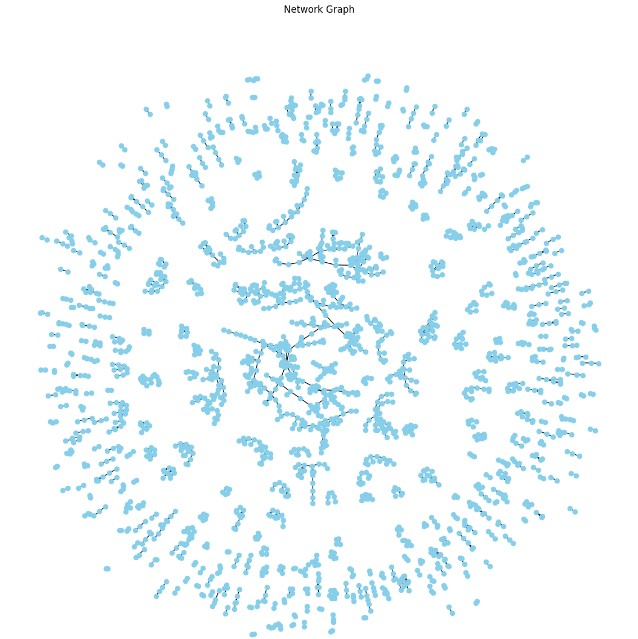

Home
==============


## Usage
- **Basic Usage**: Use `product_similarity_main.ipynb`
- **Configuration**:

  - Create new enviroment, due to hatch not been able to handle GPU resources
  ```python
  conda create --name gpu_torch python>3.9 --y
  conda activate gpu_torch
  pip install torch==2.3.1 torchvision==0.18.1 torchaudio==2.3.1 --index-url https://download.pytorch.org/whl/cu121
  pip install -r requirements_torch.txt
  ```
  -  Modify pyproject.toml to add or remove packages to run CPU packages and manager local packages

## Data
- **Sources**: The dataset is collected by CPG distributor public site.
- **Structure**: Table of key features

!!! example
    Input data format

| Text      |
| :-------- |
| `string`  |


## Result ✅
 - **Findings:**
   - After fine tuning the model, the results are the top 2 products that are similar to the given product based on their product descriptions.
   - Overall, these can be used to find comepetitors in the market or complemetary products  as transitions can be seen. As well to aid other possible niches in the market product segment to innovate.


- **Visualizations**:
  - Example visualizations (if applicable).


Directory Structure
==============

    .
    ├── docs <- markdown files for mkdocs
    │   └── img <- assets
    ├── notebooks <- jupyter notebooks for exploratory analysis and explanation
    └── src - scripts for processing data eg. transformations, dataset merges etc.
    │   ├── data <- loading, saving and modelling your data
    │   ├── features <- feature engineering
    │   ├── model <- algorithms and models
    │   ├── plots <- plots
    │   └── utils <- api and other
    ├── LICENSE <- License
    ├── mkdocs.yml <- config for mkdocs
    ├── pyproject.yml <- config project
    └── README.md <- README file of the package

## Contributing

To contribute create a PR a use conventional [commits](https://www.conventionalcommits.org/en/v1.0.0/#summary)

```
fix: <description>
feat: <description>
docs: <description>
refactor: <description>
```

**License**

The project is licensed under the MIT License.

I hope this is helpful!
